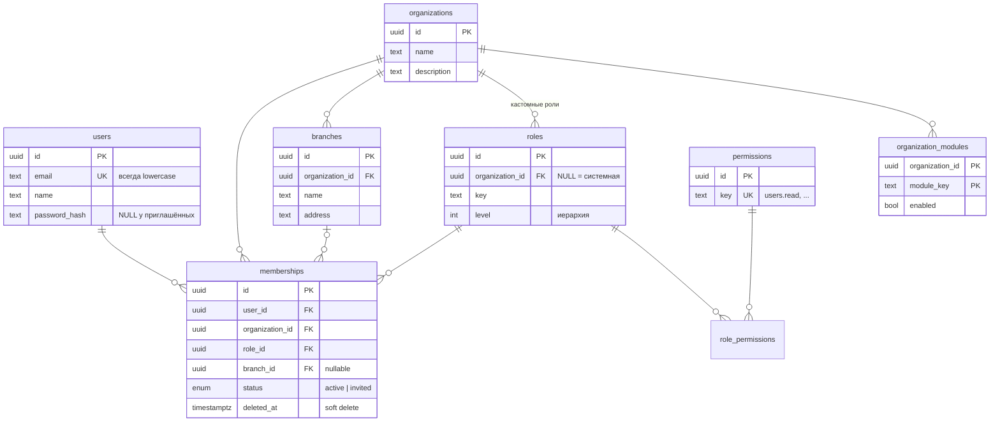

# Модуль «Пользователи организации»

Тестовое задание Fullstack Developer: модуль управления пользователями организации для multi-tenant B2B SaaS-платформы.

Один аккаунт может состоять в нескольких организациях с разными ролями. Пользователь с нужными правами может просматривать, искать и фильтровать участников организации, а также добавлять их, менять роль и филиал и удалять из организации.

## Быстрый старт

Нужен только Docker:

```bash
docker compose up --build
```

Приложение откроется на **http://localhost:8080**. При старте API применяет миграции и загружает демо-данные. Seed идемпотентный, поэтому повторный запуск ничего не дублирует.

Все демо-аккаунты используют пароль `password`. На странице входа их можно выбрать кликом.

| Аккаунт | Роли | Что показывает |
|---|---|---|
| `timur@example.com` | Альфа — администратор, Бета — менеджер, Гамма — сотрудник, Дельта — администратор | Один аккаунт в разных ролях. В Дельте модуль «Пользователи» не подключён |
| `aiganym@example.com` | Бета — администратор | Нет доступа к чужим организациям |
| `rustem@example.com` | Гамма — администратор | |
| `tamerlan@example.com` | Альфа — сотрудник | Роль без прав на модуль |

Порты: web `8080`, API `3000`, Postgres `5433`. Postgres проброшен на 5433, чтобы не конфликтовать с локальным. API и Postgres слушают только `127.0.0.1`: демо-пароль базы не должен быть доступен из сети.

## Стек

- **Backend:** NestJS 12 (ESM), Prisma 7, PostgreSQL 16
- **Frontend:** React 19, Vite, TypeScript, Mantine 9, TanStack Query, React Router
- **Тесты:** Vitest и Supertest, e2e на реальной PostgreSQL
- **Инфраструктура:** npm workspaces, Docker Compose, nginx (раздаёт SPA и проксирует `/api`, поэтому CORS не нужен)

```
apps/
├── api/
│   ├── prisma/          schema, миграции, seed
│   ├── src/
│   │   ├── auth/        логин, JWT, глобальный guard аутентификации
│   │   ├── access/      guard доступа к организации, права, иерархия ролей
│   │   ├── users/       API пользователей организации
│   │   ├── me/          профиль и список организаций текущего пользователя
│   │   └── common/      единый формат ошибок
│   └── test/            e2e-тесты
└── web/src/
    ├── api/             HTTP-клиент, типы, хуки TanStack Query
    ├── pages/users/     страница «Пользователи»
    └── lib/             тексты ошибок, зеркало правил доступа
```

## База данных



**Главная идея:** `users` хранит только глобальный аккаунт. Всё, что относится к организации (роль, филиал, статус), лежит в `memberships`. Поэтому роль определяется в рамках конкретной организации, а один человек может быть администратором в одной компании и сотрудником в другой.

| Ограничение | Зачем |
|---|---|
| `UNIQUE (user_id, organization_id)` на memberships | Один человек состоит в организации не больше одного раза |
| Составной FK `memberships(organization_id, branch_id) → branches(organization_id, id)` | Филиал участника обязан принадлежать той же организации. Это проверяет сама БД, поэтому филиал чужой организации нельзя назначить ни через API, ни в обход кода |
| `ON DELETE SET NULL (branch_id)` на этом FK | При удалении филиала обнуляется только филиал, `organization_id` остаётся. Синтаксис со списком колонок есть с PostgreSQL 15 |
| Soft delete (`deleted_at`) на memberships | Сохраняется история. Повторное добавление восстанавливает ту же строку, и уникальный ключ не мешает |
| memberships → role: `NO ACTION`, а не `RESTRICT` | При каскадном удалении организации роли и участники удаляются одним statement. `RESTRICT` проверяется сразу и сорвал бы каскад, `NO ACTION` проверяется в конце statement |
| Частичный `UNIQUE (key) WHERE organization_id IS NULL` на roles | Уникальность ключей системных ролей. В обычном UNIQUE значения NULL не равны друг другу |
| `CHECK (email = lower(email))` | Email уникален без учёта регистра, а в приложении он нормализуется |
| Индексы `memberships (organization_id, …)` | Под фильтры списка по роли, филиалу и удалённым |
| GIN `pg_trgm` на `users.name` и `users.email` | Поиск `ILIKE '%…%'` по подстроке |
| `organization_modules.module_key` — строка, а не enum | Новый модуль платформы не требует миграции |

Часть ограничений Prisma описать не умеет, поэтому они добавлены сырым SQL в init-миграцию. Подробности в разделе «Известные ограничения».

## Права доступа

**Где хранятся.** Права (`users.read`, `users.create`, `users.update`, `users.delete`) привязаны к ролям через `role_permissions`. Роль участника указана в membership. Системные роли общие для всех организаций. Схема поддерживает и кастомные роли организации (`roles.organization_id`), но UI для них не входит в задание.

| | Администратор (100) | Менеджер (50) | Сотрудник (10) |
|---|---|---|---|
| Просмотр | ✅ | ✅ | ❌ |
| Добавление | ✅ | ✅ только роли ниже своей | ❌ |
| Изменение | ✅ | ✅ только участников ниже себя | ❌ |
| Удаление | ✅ | ❌ | ❌ |

**Где проверяются.** Каждый запрос проходит два глобальных guard'а:

1. **`JwtAuthGuard`** проверяет JWT. В токене хранится только `userId`: роли и организации меняются, поэтому их не кладут в токен, а проверяют на каждом запросе. Если человека удалили из организации, его старый токен туда уже не пускает.
2. **`OrganizationAccessGuard`** автоматически срабатывает на **любом** маршруте с `:organizationId`, поэтому новый эндпоинт организации нельзя случайно оставить без защиты. Он одним запросом загружает membership текущего пользователя вместе с ролью, правами и включёнными модулями, затем:
   - если пользователь не состоит в организации или организации не существует, отвечает **404**, а не 403, чтобы не раскрывать существование чужих организаций;
   - если модуль не подключён, отвечает **403 `MODULE_DISABLED`**;
   - если нет нужного права (из `@RequirePermissions(...)` на эндпоинте), отвечает **403 `FORBIDDEN`**.

**Как защищены чужие данные.** Все запросы в сервисе фильтруются по `organizationId` из проверенного контекста. Целевой пользователь в `PATCH` и `DELETE` ищется как membership **этой** организации: подставить id человека из другой компании не получится, ответ будет 404. Карточка пользователя возвращает только данные текущей организации, без списка его других членств.

**Иерархия ролей.** Назначать роли и управлять участниками можно только **строго ниже** своего уровня (`access/role-hierarchy.ts`). Администратор — вершина иерархии и может управлять другими администраторами, но с защитой последнего администратора (см. ниже).

Фронтенд скрывает недоступные действия по тем же правилам (`web/src/lib/access.ts`), но это только удобство: все решения принимает API.

## API

Все маршруты доступны под префиксом `/api`.

| Метод | Путь | Право |
|---|---|---|
| POST | `/auth/login` | — |
| GET | `/me`, `/me/organizations` | аутентификация |
| GET | `/organizations/:organizationId/users` | `users.read` |
| GET | `/organizations/:organizationId/users/:userId` | `users.read` |
| POST | `/organizations/:organizationId/users` | `users.create` |
| PATCH | `/organizations/:organizationId/users/:userId` | `users.update` |
| DELETE | `/organizations/:organizationId/users/:userId` | `users.delete` |
| GET | `/organizations/:organizationId/roles`, `/branches` | `users.read` |

`/me/organizations` отдаёт организации пользователя с его ролью в каждой, описанием, филиалами и подключёнными модулями: по ним строится экран выбора организации. `/branches` отдаёт у каждого филиала название, адрес и `memberCount`, то есть число текущих участников. В ответах об участниках филиал приходит вместе с адресом.

**Параметры списка:**
- `page`, `pageSize` (не больше 100);
- `search` — по имени и email, без учёта регистра, `%` и `_` экранируются;
- `roleId`, `branchId` (`none` — участники без филиала), `status` (`active` / `invited`);
- `sortBy` (`name` / `email` / `createdAt` / `role`), `sortOrder`.

Поле сортировки проверяется по белому списку и превращается в фиксированный `orderBy`, так что имя колонки из запроса никогда не попадает в SQL. Для стабильной пагинации при равных значениях сортировки добавлен tiebreaker по `id`. Ответ имеет вид `{ items, total, page, pageSize }`.

**Добавление** `{ email, name?, roleId, branchId? }`:
- если аккаунт с таким email уже есть, он привязывается к организации, а его имя не перезаписывается, потому что аккаунт общий для нескольких организаций;
- если аккаунта нет, создаётся приглашённый пользователь без пароля, и тогда `name` обязателен;
- если человека раньше удаляли из организации, его membership восстанавливается.

**Изменение** `{ roleId?, branchId? }`: `branchId: null` снимает филиал, пропущенное поле не меняется.

**Ошибки** всегда приходят в одном формате `{ code, message, details? }`:

| code | HTTP | Когда |
|---|---|---|
| `UNAUTHORIZED` | 401 | Нет токена, он неверный или истёк; неверный логин или пароль |
| `NOT_FOUND` | 404 | Чужая или несуществующая организация; пользователь не состоит в этой организации |
| `FORBIDDEN` | 403 | У роли нет нужного права |
| `MODULE_DISABLED` | 403 | Организация не подключила модуль |
| `ROLE_TOO_HIGH` | 403 | Попытка назначить роль не ниже своей или управлять участником не ниже себя |
| `VALIDATION_ERROR` | 400 | Некорректные данные; филиал или роль чужой организации |
| `ALREADY_MEMBER` | 409 | Человек уже состоит в организации |
| `LAST_ADMIN` | 409 | Попытка понизить или удалить последнего активного администратора |
| `CONFLICT` | 409 | Участника одновременно изменил кто-то другой |
| `PAYLOAD_TOO_LARGE` | 413 | Тело запроса больше 100 КБ |
| `TOO_MANY_REQUESTS` | 429 | Слишком много попыток входа (есть заголовок `Retry-After`) |

## Нестандартные сценарии

Каждый сценарий покрыт e2e-тестом.

- **Последний администратор.** Нельзя понизить или удалить последнего **активного** администратора, в том числе самого себя. Приглашённый администратор без пароля не считается, потому что войти он не может.
- **Гонка двух администраторов.** Два админа одновременно понижают друг друга. Проверка берёт строки администраторов организации под `SELECT … FOR UPDATE`, поэтому вторая транзакция ждёт первую, перечитывает строки и получает `LAST_ADMIN`. Тест проверен «от противного»: без блокировки он падает 5 раз из 5.
- **Одновременное добавление одного человека.** Один запрос получает 201, другой 409. Второй аккаунт не создаётся, это гарантирует уникальный ключ. То же при одновременном восстановлении удалённого участника: восстановление — условный `UPDATE … WHERE deleted_at IS NOT NULL`, второй запрос ждёт блокировку строки и уже ничего не находит.
- **Один новый email приглашают две организации одновременно.** Оба запроса успешны и ссылаются на один аккаунт: он создаётся через `INSERT … ON CONFLICT DO NOTHING`.
- **Изменение участника, которого параллельно повысили.** Права проверяются по текущей роли цели, а запись применяется только если роль осталась той же (`UPDATE … WHERE role_id = <прочитанная>`). Иначе 409 `CONFLICT`: правка менеджера не перезапишет роль человека, которого только что сделали администратором.
- **Кастомная роль с ключом `admin`** не считается администратором для правила последнего администратора: оно проверяет именно системную роль.
- **IDOR.** id пользователя из другой организации в URL своей даёт 404, чужие данные не меняются.
- **Эскалация привилегий.** Менеджер не может назначить роль менеджера или администратора и не может редактировать равных себе или выше, включая себя.
- **Филиал или роль чужой организации** дают 400. Для филиала это дополнительно гарантирует составной FK в БД.
- **Удаление из организации** не удаляет ни аккаунт, ни членство в других организациях.
- **Повторное добавление удалённого** восстанавливает membership.
- **Некорректные параметры** (`pageSize=10000`, `page=1e20`, `sortBy=password_hash`, `roleId: null`, неизвестные поля в body) дают 400, а не 500.
- **Логин.** Email принимается без учёта регистра и пробелов. Время ответа не выдаёт, существует ли email: пароль сравнивается с фиктивным хэшем. Приглашённые без пароля войти не могут.
- **Подбор пароля.** Не больше 5 попыток входа на один email за 15 минут, успешный вход сбрасывает счётчик; дальше 429 с `Retry-After`. Попытка засчитывается до проверки пароля, поэтому параллельные запросы лимит не обходят. Ключ — email, а не IP: за nginx у всех один IP, а `X-Forwarded-For` можно подделать. Цена решения: чужой email можно заблокировать на 15 минут.

## Frontend

Страница «Организация → Пользователи»:

- таблица с аватаром, ролью, филиалом (название и адрес), статусом и датой добавления;
- поиск с задержкой 300 мс, фильтры по роли, филиалу (с числом участников, включая «Без филиала») и статусу;
- сортировка по клику на заголовок, пагинация с выбором размера страницы;
- **состояние страницы хранится в URL** (фильтры, сортировка, страница, открытая карточка): переживает перезагрузку, ссылкой можно поделиться;
- модалка добавления и редактирования: предлагаются только роли, которые текущий пользователь может назначить (`GET /roles` отдаёт `assignable`), а ошибки API показываются у нужного поля;
- подтверждение удаления, карточка пользователя в боковой панели;
- состояния:
  - загрузка (skeleton);
  - ошибка с кнопкой «Повторить»;
  - два разных пустых состояния: «в организации никого нет» и «ничего не найдено»;
  - три экрана без доступа с объяснением причины: не член организации, модуль не подключён, роль без прав;
- переключатель организаций в шапке, работает и на мобильной ширине.

## Тесты

```bash
docker compose up -d db
npm install
npm run test:e2e
```

Тесты используют отдельную базу `org_users_test`: она создаётся автоматически, к ней применяются миграции, а перед каждым набором она очищается и засевается заново. Хелпер очистки отказывается работать с базой, имя которой не оканчивается на `_test`. Другую базу можно указать через `TEST_DATABASE_URL`.

Всего 100 тестов, прогон занимает около 20 секунд:
- `access` — аутентификация, изоляция организаций, отключённый модуль, матрица «роль × эндпоинт» для одного аккаунта в трёх организациях;
- `members-read` — пагинация (страницы не пересекаются и покрывают всех), поиск, фильтры, сортировка, валидация параметров, IDOR в карточке;
- `members-write` — все сценарии из раздела выше, включая гонки.

Фронтенд проверялся вручную в headless Chrome: основные сценарии, состояния и мобильная ширина. Автотестов для UI нет, см. «Что бы сделал дальше».

## Локальная разработка без Docker

```bash
docker compose up -d db                  # только Postgres
cp .env.example apps/api/.env
npm install
npm run db:migrate -w api && npm run db:seed -w api
npm run dev:api                          # http://localhost:3000/api
npm run dev:web                          # http://localhost:5173, /api проксируется
```

## Принятые решения и компромиссы

- **Мягкое удаление участника, но не аккаунта.** Сохраняется история, повторное добавление работает без конфликтов уникальности.
- **Добавление по email вместо выбора из списка всех пользователей.** Администратор организации не должен видеть пользователей других организаций. Если email уже зарегистрирован, аккаунт привязывается, и дубликат не создаётся.
- **404 вместо 403 для чужих организаций.** Не раскрываем, какие организации существуют. Внутри своей организации отвечаем 403, потому что сам факт членства уже известен.
- **Offset-пагинация.** Для таблицы с номерами страниц и `total` она проще и привычнее. Стабильность при равных значениях сортировки обеспечивает tiebreaker по `id`.
- **Права проверяются по permissions, а не по названиям ролей.** Кастомные роли добавляются данными, без изменения кода. Исключение — правило последнего администратора: оно привязано к системной роли `admin`.
- **Проверка организации в глобальном guard'е**, а не через `@UseGuards` на каждом контроллере: безопасно по умолчанию.
- **JWT без refresh-токенов** и с хранением в `localStorage`. Для тестового этого достаточно, в продакшене нужен httpOnly cookie и refresh. Риск кражи токена через XSS снижает CSP: nginx разрешает скрипты только со своего origin. Алгоритм подписи зафиксирован (`HS256`).
- **Заголовки безопасности** ставит nginx: CSP, `X-Frame-Options: DENY`, `X-Content-Type-Options: nosniff`, `Referrer-Policy`. API не сообщает `X-Powered-By`, контейнер API работает не от root.

## Известные ограничения

- **Prisma и составной FK.** Prisma не умеет описать составной FK на филиал, поэтому `prisma migrate dev` всегда будет предлагать удалить `memberships_organization_branch_fkey`. Новые миграции нужно создавать через `prisma migrate dev --create-only` и удалять эту строку вручную (см. комментарий в `schema.prisma`). `migrate deploy`, который используется в Docker, этого не касается.
- **`npm audit`** показывает уязвимости в транзитивной зависимости Prisma CLI (`mysql2`). Это dev-инструмент, в рантайм-код он не попадает.
- **Роль из чужой организации** проверяется в коде, а не FK: у системных ролей `organization_id IS NULL`, и составной ключ здесь неприменим.

## Что бы сделал дальше

- Аудит-лог изменений (кто, кому, что поменял)
- Приглашения по email со ссылкой для установки пароля
- UI для кастомных ролей организации
- Автотесты фронтенда (Playwright), unit-тесты для правил иерархии
- Row Level Security в PostgreSQL как второй слой изоляции организаций
- httpOnly cookie, refresh-токены; лимит попыток входа в Redis (сейчас в памяти процесса, для нескольких инстансов не подходит)
- Cursor-пагинация для больших организаций
